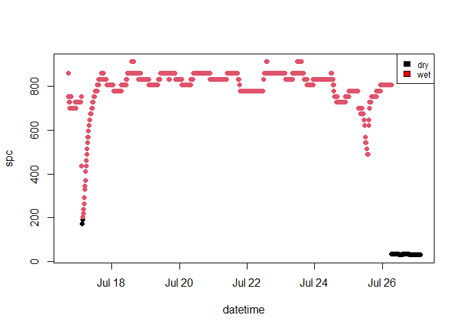

<!-- README.md is generated from README.Rmd. Please edit that file -->

# STICr

<!-- badges: start -->
<!-- badges: end -->

The goal of STICr is to provide a standardized set of functions for
working with data from Stream Temperature, Intermittency, and
Conductivity (STIC) loggers, first described in [Chapin et
al. (2014)](http://onlinelibrary.wiley.com/doi/10.1002/2013WR015158/abstract).
STICs and other intermittency sensors are becoming more popular, but
their raw data output is not in a form that allows for convenient
analysis. This package aims to provide a set of functions for tidying
the raw data from these loggers, as well as calibrating their
conductivity measurements to specific conductivity (`spc`).
Additionally, the `classify_wetdry` function allows the user to define
both a method and threshold value to generate a binary “wet/dry” data
set.

## Installation

You can install the development version of STICr from
[GitHub](https://github.com/HEAL-KGS/STICr) with:

``` r
# install.packages("devtools")
devtools::install_github("HEAL-KGS/STICr")
```

## Example

This is an example workflow that shows the main functionality of the
package. This first function is called `tidy_hobo_data` and is
demonstrated below. The function intakes a raw CSV file and outputs a
tidy data frame with the following column names: `datetime`,
`conductivity_uncal`, and `temperature`.

``` r
library(STICr)

clean_data <- tidy_hobo_data(infile = "https://raw.githubusercontent.com/HEAL-KGS/STICr/main/data/raw_hobo_data.csv", outfile = FALSE)
#> Loading required package: lubridate
#> 
#> Attaching package: 'lubridate'
#> The following objects are masked from 'package:base':
#> 
#>     date, intersect, setdiff, union
#> Warning: replacing previous import 'lifecycle::last_warnings' by
#> 'rlang::last_warnings' when loading 'pillar'
head(clean_data)
#>              datetime conductivity_uncal temperature
#> 1 2021-07-16 17:00:00            88178.4      27.764
#> 2 2021-07-16 17:15:00            77156.1      28.655
#> 3 2021-07-16 17:30:00            74400.5      28.060
#> 4 2021-07-16 17:45:00            74400.5      27.764
#> 5 2021-07-16 18:00:00            74400.5      27.862
#> 6 2021-07-16 18:15:00            71644.9      27.370
```

Below are time series plots of the uncalibrated conductivity and
temperature generated by `tidy_hobo_data`

``` r
plot(clean_data$datetime, clean_data$conductivity_uncal, type = "l", lty = 1, 
     xlab = "datetime", ylab = "uncalibrated conductivity")
```


``` r
plot(clean_data$datetime, clean_data$temperature, type = "l", lty = 1, 
     xlab = "datetime", ylab = "temperature")
```


The second function is called `get_calibration` and is demonstrated
below. The function intakes a STIC calibration data frame with columns
`standard` and `conductivity_uncal`and outputs a fitted model object
relating `spc` to the uncalibrated conductivity values measured by the
STIC.

``` r
# Example calibration data
head(calibration_standard_data)
#> # A tibble: 4 x 3
#>     sensor standard conductivity_uncal
#>      <dbl>    <dbl>              <dbl>
#> 1 20946471      100             12400.
#> 2 20946471      250             23422.
#> 3 20946471      500             46845.
#> 4 20946471     1000            104712.

# Creating model object using a linear interpolation method. User can also chose the "exponential" method
lm_calibration <- get_calibration(calibration_standard_data, method = "linear")

# Result is a fitted model object
summary(lm_calibration)
#> 
#> Call:
#> lm(formula = standard ~ conductivity_uncal, data = calibration_data)
#> 
#> Residuals:
#>      1      2      3      4 
#> -33.43  11.27  37.50 -15.34 
#> 
#> Coefficients:
#>                     Estimate Std. Error t value Pr(>|t|)   
#> (Intercept)        1.496e+01  3.136e+01   0.477   0.6803   
#> conductivity_uncal 9.554e-03  5.328e-04  17.932   0.0031 **
#> ---
#> Signif. codes:  0 '***' 0.001 '**' 0.01 '*' 0.05 '.' 0.1 ' ' 1
#> 
#> Residual standard error: 37.99 on 2 degrees of freedom
#> Multiple R-squared:  0.9938, Adjusted R-squared:  0.9907 
#> F-statistic: 321.5 on 1 and 2 DF,  p-value: 0.003096
```

The third function is called `apply_calibration` and is demonstrated
below. The function intakes a tidy STIC data frame (as generated
by`tidy_hobo_data`), as well as the fitted model object generated by
`get_calibration`. It outputs the same STIC data frame as input, except
with a new column called `spc`. This will be in the same units as the
data used to develop the model calibration.

``` r
# applying the lm_calibration object from the previous example to the tidy data frame to generate the calibrated spc column
calibrated_df <- apply_calibration(clean_data, lm_calibration)
head(calibrated_df)
#>              datetime conductivity_uncal temperature      spc
#> 1 2021-07-16 17:00:00            88178.4      27.764 857.3845
#> 2 2021-07-16 17:15:00            77156.1      28.655 752.0820
#> 3 2021-07-16 17:30:00            74400.5      28.060 725.7561
#> 4 2021-07-16 17:45:00            74400.5      27.764 725.7561
#> 5 2021-07-16 18:00:00            74400.5      27.862 725.7561
#> 6 2021-07-16 18:15:00            71644.9      27.370 699.4302
```

Below is a time series plot of the calibrated spc values

``` r
plot(calibrated_df$datetime, calibrated_df$spc, type = "l", lty = 1, 
     xlab = "datetime", ylab = "specific conductivity")
```


The final function is called `classify_wetdry` and is demonstrated
below. This function intakes a data frame with STIC data (such as that
produced by `apply_calibration` or `tidy_hobo_data.` The user is also
asked to specify a method for classification, as well as a threshold
associated with that method. Currently, methods include either an
absolute numerical threshold or a percentage of the highest value of the
classification variable. It outputs the same STIC data frame as input,
except with a new binary column called `wetdry`.

``` r
# Creating classified data frame using "spc" as the classification variable, and an absolute threshold as the method for classification. The spc threshold chosen in this case is 200. 
classified_df <- classify_wetdry(calibrated_df, classify_var = "spc", method = "absolute",
                                 threshold = 200)
#> Loading required package: dplyr
#> 
#> Attaching package: 'dplyr'
#> The following objects are masked from 'package:stats':
#> 
#>     filter, lag
#> The following objects are masked from 'package:base':
#> 
#>     intersect, setdiff, setequal, union
head(classified_df)
#>              datetime conductivity_uncal temperature      spc wetdry
#> 1 2021-07-16 17:00:00            88178.4      27.764 857.3845    wet
#> 2 2021-07-16 17:15:00            77156.1      28.655 752.0820    wet
#> 3 2021-07-16 17:30:00            74400.5      28.060 725.7561    wet
#> 4 2021-07-16 17:45:00            74400.5      27.764 725.7561    wet
#> 5 2021-07-16 18:00:00            74400.5      27.862 725.7561    wet
#> 6 2021-07-16 18:15:00            71644.9      27.370 699.4302    wet
```

Below is a time series plot of the calibrated `spc` values colored by
wet versus dry periods.

``` r
classified_df$wetdry <- as.factor(classified_df$wetdry)
plot(classified_df$datetime, classified_df$spc, col = classified_df$wetdry, lty = 1, type = "l",  
     xlab = "datetime", ylab = "specific conductivity")
```


