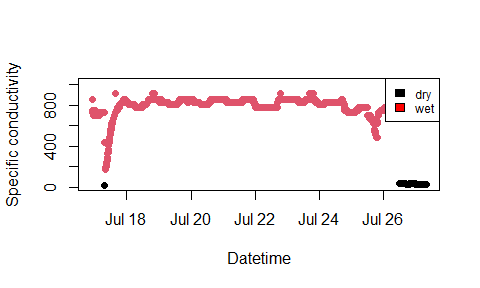

<!-- README.md is generated from README.Rmd. Please edit that file -->

# STICr

<!-- badges: start -->
<!-- badges: end -->

The goal of STICr (pronounced “sticker”) is to provide a standardized
set of functions for working with data from Stream Temperature,
Intermittency, and Conductivity (STIC) loggers, first described in
[Chapin et
al. (2014)](https://agupubs.onlinelibrary.wiley.com/doi/abs/10.1002/2013WR015158).
STICs and other intermittency sensors are becoming more popular, but
their raw data output is not in a form that allows for convenient
analysis. This package aims to provide a set of functions for tidying
the raw data from these loggers, as well as calibrating their
conductivity measurements to specific conductivity (`SpC`) and
classifying the conductivity data to generate a classified “wet/dry”
data set.

## Installation

You can install STICr from CRAN or the development version of STICr from
[GitHub](https://github.com/HEAL-KGS/STICr) with:

``` r
# install.packages("STICr")  # if needed: install package from CRAN
# devtools::install_github("HEAL-KGS/STICr") # if needed: install dev version from GitHub
library(STICr)
```

## Example

This is an example workflow that shows the main functionality of the
package. A more detailed version is available in the package vignette.

### Step 1: Load data

``` r
# read in raw HOBO data and tidy
df_tidy <- tidy_hobo_data(infile = "https://samzipper.com/data/raw_hobo_data.csv", outfile = FALSE)
head(df_tidy)
#>              datetime condUncal  tempC
#> 1 2021-07-16 22:00:00   88178.4 27.764
#> 2 2021-07-16 22:15:00   77156.1 28.655
#> 3 2021-07-16 22:30:00   74400.5 28.060
#> 4 2021-07-16 22:45:00   74400.5 27.764
#> 5 2021-07-16 23:00:00   74400.5 27.862
#> 6 2021-07-16 23:15:00   71644.9 27.370
```

### Step 2: Get and apply calibration

The second function is called `get_calibration` and is demonstrated
below. The function intakes a STIC calibration data frame with columns
`standard` and `conductivity_uncal`and outputs a fitted model object
relating `spc` to the uncalibrated conductivity values measured by the
STIC.

``` r
# load calibration
lm_calibration <- get_calibration(calibration_standard_data)

# apply calibration
df_calibrated <- apply_calibration(
  stic_data = df_tidy,
  calibration = lm_calibration,
  outside_std_range_flag = T
)
head(df_calibrated)
#>              datetime condUncal  tempC      SpC outside_std_range
#> 1 2021-07-16 22:00:00   88178.4 27.764 857.3845                  
#> 2 2021-07-16 22:15:00   77156.1 28.655 752.0820                  
#> 3 2021-07-16 22:30:00   74400.5 28.060 725.7561                  
#> 4 2021-07-16 22:45:00   74400.5 27.764 725.7561                  
#> 5 2021-07-16 23:00:00   74400.5 27.862 725.7561                  
#> 6 2021-07-16 23:15:00   71644.9 27.370 699.4302
```

### Step 3: Classify data

``` r
# classify data
df_classified <- classify_wetdry(
  stic_data = df_calibrated,
  classify_var = "SpC",
  threshold = 100,
  method = "absolute"
)
head(df_classified)
#>              datetime condUncal  tempC      SpC outside_std_range wetdry
#> 1 2021-07-16 22:00:00   88178.4 27.764 857.3845                      wet
#> 2 2021-07-16 22:15:00   77156.1 28.655 752.0820                      wet
#> 3 2021-07-16 22:30:00   74400.5 28.060 725.7561                      wet
#> 4 2021-07-16 22:45:00   74400.5 27.764 725.7561                      wet
#> 5 2021-07-16 23:00:00   74400.5 27.862 725.7561                      wet
#> 6 2021-07-16 23:15:00   71644.9 27.370 699.4302                      wet
```

### Step 4: QAQC

``` r
# apply qaqc function
df_qaqc <-
  qaqc_stic_data(
    stic_data = df_classified,
    spc_neg_correction = T,
    inspect_classification = T,
    anomaly_size = 2,
    window_size = 96,
    concatenate_flags = T
  )
head(df_qaqc)
#>              datetime condUncal  tempC      SpC wetdry QAQC
#> 1 2021-07-16 22:00:00   88178.4 27.764 857.3845    wet     
#> 2 2021-07-16 22:15:00   77156.1 28.655 752.0820    wet     
#> 3 2021-07-16 22:30:00   74400.5 28.060 725.7561    wet     
#> 4 2021-07-16 22:45:00   74400.5 27.764 725.7561    wet     
#> 5 2021-07-16 23:00:00   74400.5 27.862 725.7561    wet     
#> 6 2021-07-16 23:15:00   71644.9 27.370 699.4302    wet
table(df_qaqc$QAQC)
#> 
#>      DO   O 
#> 916   1  83
```

### Step 5: Plot classified data

``` r
# plot SpC through time, colored by wetdry
plot(df_classified$datetime, df_classified$SpC,
  col = as.factor(df_classified$wetdry),
  pch = 16,
  lty = 2,
  xlab = "Datetime",
  ylab = "Specific conductivity"
)
legend("topright", c("dry", "wet"),
  fill = c("black", "red"), cex = 0.75
)
```


